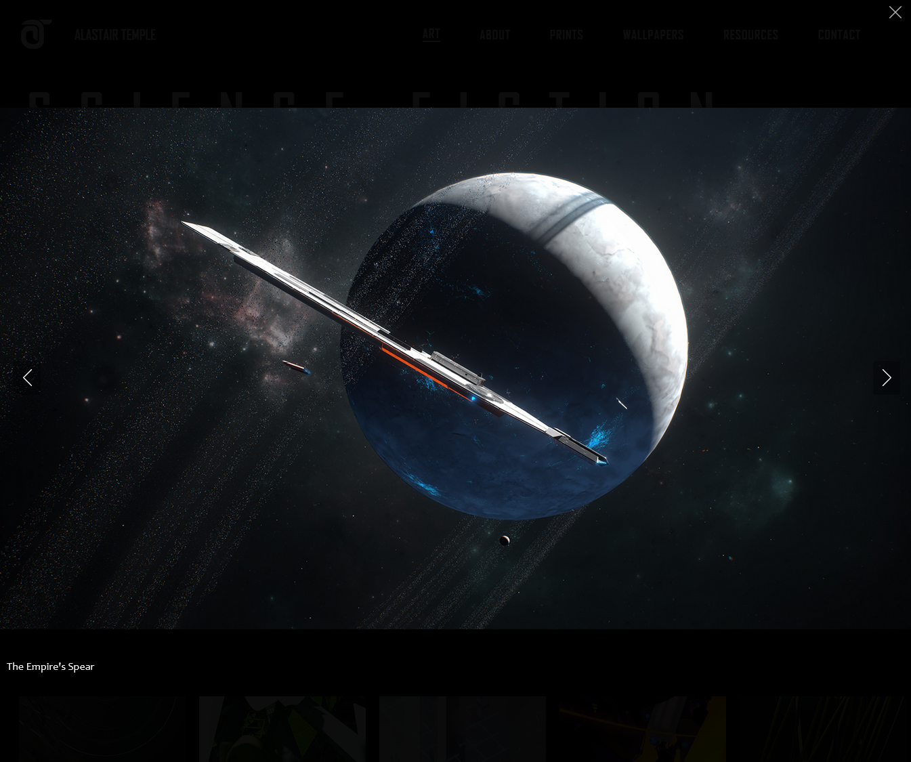

# PHP Gallery Generator
## Introduction
I utilise two variations of the php snippet described here (in condjunction with [GLightbox](https://biati-digital.github.io/glightbox/)) to create the galleries on my homepage and wallpaper downloads page:





## Overview and Setup
In simple terms the php script looks in a defined folder (relative to its own location) to find image files. It then loops through every image to generate a bit of html with information from the image insert into the html.

I will use my homepage Sci-fi gallery as an example. In the same directory as my home.php page I have a folder called "scifi" which holds all of the full size images, within this folder I also have a sub folder "thumbs" which contains all the corresponding thumbnails. Both the full size images and their corresponding thumbnails **must** have the same name otherwise the script will not work in its current form (e.g. full size *image1.jpg* must have a matching thumbnail image in the *thumbs* folder called *image1.jpg*).

When the script is set up, all that is needed to add a new image to the gallery is to add its full size image and thumbnail to the folders.

## The script

The script is as follows and should be placed in the correct location for your gallery in your webpage (note: while this will then be a .php file, the rest of the file should be setup as a typical html page):

```php
   <?php
                $files = glob("scifi/*.*");
                usort($files, function($a, $b) {
                    return filemtime($b) - filemtime($a);
                });
                for ($i=0; $i<count($files); $i++)
                {
                    $image = $files[$i];
                    $supported_file = array(
                            'gif',
                            'jpg',
                            'jpeg',
                            'png'
                    );

                    $thumb = "scifi/thumbs/".pathinfo($image, PATHINFO_BASENAME);
                    $title = pathinfo($image, PATHINFO_FILENAME);
                    if (in_array($ext, $supported_file)) {
                        echo "<div class='gal_container'>";
                        echo '<a href="'.$image .'" class="glightbox" data-gallery="Science Fiction" data-glightbox="title:'.$title .';"  onclick="handleImgClick(true)"/></a>';
                        echo "</div>";
                        } else {
                            continue;
                        }
                    }
                ?>
```
Set by step the elements of the script are:

`$files = glob("scifi/*.*");` looks into the *scifi* folder and gets a list of all the files within it (but not its subfolders). In the next section before the loop the `usort` sorts the list into newest first.

We then loop through every file in the list (`for ($i=0; $i<count($files); $i++)`) and first check if the file is an image, if not we discount it. We then create 2 new variables from the file:
1. The path to the thumbnail for it, this takes the file name and adds the path including the *thumb* folder.
2. The image title, for use in alt text and the lightbox title text (this is from the image name minus it's extensions).

Finally we then (if the file is an image) create a section of html with the use of `echo` to generate output. An example of the generated output for a piece called "Daylight Rising can be seen below. The html is written out in the code above with the variables placed where they need to be to complete links to images or provide text for titles or descriptions.

```html
<div class='gal_container'>
    <a href="scifi/Daylight Rising.jpg" class="glightbox" data-gallery="Science Fiction" data-glightbox="title:Daylight Rising;"  onclick="handleImgClick(true)"/></a>
</div>
```

For my homepage this code is done within a `<div>` with the class *gallery* and the styling of the gallery and it's layout (in my case a horizontally scrolling row of thumbnails) is managed in css with this container and the *gal_container* shown in the generated snippit.

The styling and functionality of the final html can therefore be easily adapted by simply adjusting the the generated html. 

In a similar manner for the wallpaper section of my website I use the same method to create a list of the resolutions for each wallpaper I have available for download (this uses `glob` twice, to first generate a list of wallpapers from folder names, and then a list of files within each folder where they are named *thumb* for the thumbnail and then the by resolution).